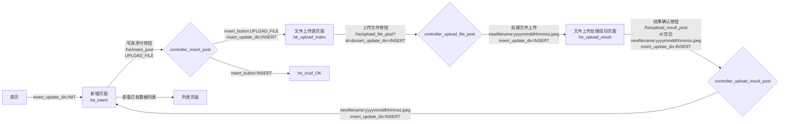

```mermaid
graph LR
A[首页] -->|insert_update_div:INIT| B[新增页面<br>he_insert]
B --> |写真添付按钮<br>/he/insert_post<br>UPLOAD_FILE|G{controller_insert_post}
G-->|insert_button:UPLOAD_FILE<br>insert_update_div:INSERT| C[文件上传首页面<br>he_upload_index]
G-->|insert_button:INSERT| H[he_crud_OK]
C -->|上传文件按钮<br>/he/upload_file_post?id=&insert_update_div=INSERT| I{controller_upload_file_post}
I-->|处理文件上传<br>newfilename:yyyymmddhhmmss.jpeg<br>insert_update_div:INSERT| F[文件上传处理成功页面<br>he_upload_result]
F-->|结果确认按钮<br>/he/upload_result_post<br>id:空白<br>newfilename:yyyymmddhhmmss.jpeg<br>insert_update_div:INSERT| J{controller_upload_result_post}
J -->|newfilename:yyyymmddhhmmss.jpeg<br>insert_update_div:INSERT| B
B -->|查看已有数据列表| D[列表页面]
```
